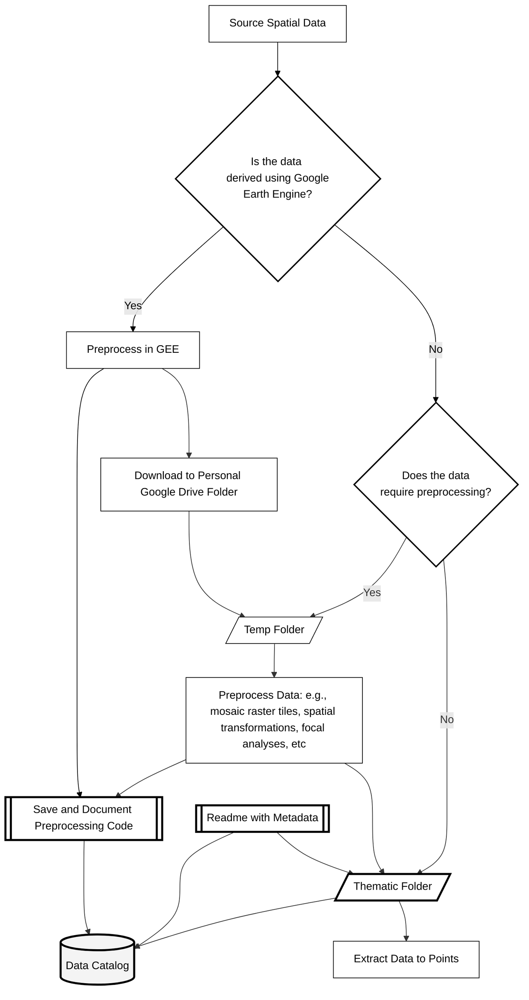

<!--

-->

# Geospatial Data Catalog and Management Guide

Here, we provide of catalog of all of geospatial data gathered and managed by the Science Centre, and R package/vignette for querying the catalog, links to external catalogs, and guide for the internal management of geospatial data.

The catalog documents all spatial data that has been pre-processed for the ABMI Science Centre. 

The catalog includes:
- Metadata for each dataset.
- Relative paths to the data stored on the Science Centre's internal server.
- Links to associated preprocessing scripts.

In addition, a working list of predictor variables [here](https://github.com/bgcasey/spatial_data_catalog/blob/main/predictor_variable_list.csv).

This is a sibling repository to the Science Centre's [Geospatial Preprocessing and Extraction Toolkit](https://github.com/bgcasey/geospatial_preprocessing_and_extraction_toolkit).
The toolkit contains genalized preprossing scripts, Google Earth Engine functions, and a vignette for summarizing spatial data to points and polygons using R.

 

## Table of Contents
- [1. Data Catalogs](#1-data-catalogs)
- [2. Scripts for Extracting and Processing Spatial Data](#2-scripts-for-extracting-and-processing-spatial-data)
- [3. Data Storage](#3-data-storage)
- [4. Metadata Standards](#4-metadata-standards)
- [5. Spatial Data Storage and Extraction Workflow](#5-spatial-data-storage-and-extraction-workflow)

---

## 1. Data Catalogs

### Internal Catalog
- [Predictor Variable List](predictor_variable_list.csv)
- Spatial data stored on the Science Centre's server.

### External Catalogs

- [Alberta Government Open Data](https://open.alberta.ca/opendata)
- [AltaLIS Open Data](https://www.altalis.com/)
- [Arctic-Boreal Vulnerability Experiment (ABoVE) Products](https://daac.ornl.gov/cgi-bin/dataset_lister.pl?p=34)
- [Awesome GEE Community Catalog](https://developers.google.com/earth-engine/datasets)
- [Google Earth Engine Data Catalog](https://developers.google.com/earth-engine/datasets)
- [National Terrestrial Ecosystem Monitoring System for Canada (NTEMS)](https://opendata.nfis.org/mapserver/nfis-change_eng.html)

**Spectral Indices**

- [Awesome Spectral Indices](https://github.com/awesome-spectral-indices/awesome-spectral-indices?tab=readme-ov-file)

---

## 2. Scripts for Extracting and Processing Spatial Data

- [Google Earth Engine Functions](https://github.com/bgcasey/google_earth_engine_functions)
- R
- ArcGIS Python

---

## 3. Data Storage

Once downloaded, data should be stored in a spatial data directory in folders organized by data thematic type. The script [create_spatial_data_dir.py](scripts/create_spatial_data_dir.py) can be used to create an empty directory. Each spatial dataset should be stored in a subfolder stored within the corresponding thematic folder. Thematic folders are based on [ISO 19115 Topic Categories](https://nap.geogratis.gc.ca/metadata/register/registerItems-eng.html#RI_653). 

**Table 1.** Thematic directories for organizing geospatial data, directory descriptions, and examples of corresponding geospatial data.

| **Folder (ISO Topic Category Name)** | **Description**                                                                  | **Examples**                                                                                                                                                                       |
| ------------------------------------ | -------------------------------------------------------------------------------- | ---------------------------------------------------------------------------------------------------------------------------------------------------------------------------------- |
| **farming**                          | Rearing of animals and/or cultivation of plants.                                 | Agriculture, irrigation, aquaculture, plantations, herding, pests and diseases affecting crops and livestock.                                                                      |
| **biota**                            | Flora and/or fauna in natural environments.                                      | Wildlife, vegetation, biological sciences, ecology, wilderness areas, wetlands, habitat.                                                                                           |
| **boundaries**                       | Legal land descriptions.                                                         | Political and administrative boundaries.                                                                                                                                           |
| **climatologyMeteorologyAtmosphere** | Processes and phenomena of the atmosphere.                                       | Cloud cover, weather, climate, atmospheric conditions, climate change, precipitation.                                                                                              |
| **economy**                          | Economic activities, conditions, and employment.                                 | Production, labor, revenue, commerce, industry, tourism, forestry, fisheries, commercial or subsistence hunting.                                                                   |
| **elevation**                        | Height above or below sea level.                                                 | Altitude, bathymetry, digital elevation models, slope, derived products.                                                                                                           |
| **environment**                      | Environmental resources, protection, and conservation.                           | Environmental pollution, waste storage and treatment, environmental impact assessment, monitoring environmental risk, nature reserves.                                             |
| **geoscientificInformation**         | Information pertaining to earth sciences.                                        | Geology, minerals, geophysical features and processes, hydrology, glacial geology, erosion, geomorphology, sedimentation.                                                          |
| **health**                           | Health, health services, human ecology, and safety.                              | Disease, illness, public health, health services.                                                                                                                                  |
| **imageryBaseMapsEarthCover**        | Base maps.                                                                       | Land cover, topographic maps, imagery.                                                                                                                                |
| **intelligenceMilitary**             | Military bases, structures, activities.                                          | Barracks, training grounds, military transportation, information collection.                                                                                                       |
| **inlandWaters**                     | Inland water features, drainage systems, and their characteristics.              | Rivers and glaciers, salt lakes, water utilization plans, dams, currents, floods, water quality, hydrographic charts.                                                              |
| **location**                         | Positional information and services.                                             | Addresses, geodetic networks, control points, postal zones, place names.                                                                                                           |
| **oceans**                           | Features and characteristics of salt water bodies (excluding inland waters).     | Tides, tidal waves, coastal information, reefs.                                                                                                                                    |
| **planningCadastre**                 | Information used for appropriate actions for future use of the land.             | Land use maps, zoning maps, cadastral surveys, land ownership.                                                                                                                     |
| **society**                          | Characteristics of society and culture.                                          | Settlements, anthropology, archaeology, education, traditional beliefs, manners and customs, demographic data, recreational areas and activities.                                  |
| **structure**                        | Man-made construction.                                                           | Buildings, museums, churches, factories, housing, monuments, shops, towers.                                                                                                        |
| **transportation**                   | Means and aids for conveying persons and/or goods.                               | Roads, airports, airstrips, shipping routes, tunnels, nautical charts, vehicle and vessel locations, aeronautical charts, railways, trails.                                        |
| **utilitiesCommunication**           | Energy, water and waste systems, and communications infrastructure and services. | Hydro-electricity, geothermal, solar and nuclear sources of energy, water purification, sewage treatment, electricity and gas distribution, data communication, telecommunication. |

---

## 4. Metadata Standards

Spatial data folders should include all data and metadata necessary to ensure efficient and reproducible workflows.

**Table 2.** Directory structure for organizing spatial data and metadata, including descriptions of folder contents and file types.

| **Item**          | **Description**                                                                                                                                                                                                  |
| ----------------- | ---------------------------------------------------------------------------------------------------------------------------------------------------------------------------------------------------------------- |
| **data_type/**    | Folder for organizing data by thematic type, including climate, vegetation structure, spectral imagery, elevation, or land use. This structure ensures clarity and accessibility for various spatial data types. |
| ├── **data/**     | Folder containing the spatial data (rasters, shapefiles) and metadata                                                                                                                                            |
| │   ├── data.tif  | Raster data                                                                                                                                                                                                      |
| │   ├── data.shp  | Vector data                                                                                                                                                                                                      |
| │   ├── readme.md | Readme file includes product metadata, description, citation, and GitHub links to preprocessing scripts.                                                                                                         |

All spatial data should include a `readme.txt` file with metadata that complies with the **[North American Profile (NAP) of the ISO 19115: Geographic Information – Metadata Standard](https://www.fgdc.gov/standards/projects/incits-l1-standards-projects/NAP-Metadata)**. Metadata should include:

- **Title**: Clear and descriptive name.
- **Abstract**: Concise summary of the dataset's purpose, content, and scope.
- **Spatial Extent**: Bounding coordinates.
- **Temporal Extent**: Timeframe of data (e.g., 2010–2020 or "Ongoing").
- **Spatial and Temporal Resolution**: The granularity of the data (e.g., "30m resolution, monthly intervals").
- **Lineage**: Origin, processing history, and data sources.
- **Access and Use Constraints**: Licensing, usage rights, and restrictions.

See the [Spatial Metadata Template](spatial_metadata_template.txt) for more information. 

---

## 5. Spatial Data Storage and Extraction Workflow

The workflow begins with sourceing biologically relevent spatial data determining if it needs to be manaully derived using Google Earth Engine (GEE). If yes, preprocessing is done using GEE. Once preprocessed the spatial data is exported to a personal Google Drive folder, and subsequently stored in a temporary folder for further preprocessing. Non-GEE data is assessed to check if preprocessing is required. If preprocessing is necessary, the data is also stored in the temporary folder and processed. Once ready, preprocessed data is stored within a subdirectory of the thematic folder corresponding to its topic category (e.g. biota, elevation, or inlandWaters). Along with the spatial data, a metadata file documenting the preprocessing steps is within the same directory. Finally, the processed data is extracted to specific points for further analysis. 

**Figure 1.** Conceptual diagram of the Science Centre's geospatial data managemet workflow, including sourcing, preprocessing, storage, and extraction.
